# Coworking Space Booking

A backend API for managing workspace and conference room bookings in a coworking space.  
Built with **TypeScript, Node.js, Express, Prisma, and PostgreSQL**, running on **Docker** while developing locally. The deployed version uses PostgreSQL on Supabase.

## Features
- User authentication
- Workspace & conference room management
- Booking system with availability checks
- Prisma ORM for database interactions
- PostgreSQL database running in Docker (while developing locally). 
- Deployed - PostgreSQL database at Supabase
- Environment variable configuration with `.env` (while developing locally)
- Deployed - Environment variables is set on Heroku Config vars.
- TypeScript for type safety

## Technologies Used
- **Backend:** Node.js, Express, TypeScript
- **Database:** PostgreSQL (via Docker)
- **ORM:** Prisma
- **Containerization:** Docker & Docker Compose
- **Environment Configuration:** dotenv

## Project Setup

### 1️. Clone the Repository
```
git clone https://github.com/yourusername/coworking-booking.git
cd coworking-booking
```
### 2️. Install Dependencies
```
npm install
```
### 3️. Start PostgreSQL in Docker
(Make sure Docker Desktop is running)
```
npm run postgres:start-locally
```
This starts a PostgreSQL container with Docker Compose.

### 4. Start Redis in Docker
```
npm run redis:start-locally
```
This starts a Redis container with Docker.

### 5. Apply Database Migrations
```
npm run prisma:migrate
```
This initializes the database schema using Prisma.

### 6. Start the Server
```
npm run dev
```
Runs the server in development mode with nodemon.

### 7. Test the API
The server runs on http://localhost:4444 (configurable via .env).

### 8. Start Everything Together (Optional)
If everything has been set up once, you can start PostgreSQL, Redis, and the server at the same time using:   
```
npm run all:start
```

## Project Structure
```
coworking-booking/
├── dist/
├── docker-data/
├── logs/
│   ├── combined.log
│   └── error.log
├── node_modules/
├── prisma/
│   ├── migrations/
│   └── schema.prisma
├── public/
│   └── client.html
├── Readmefiles/
├── src/
│   ├── controllers/
│   │   ├── authController.ts
│   │   ├── bookingController.ts
│   │   ├── roomController.ts
│   │   └── userController.ts
│   ├── middleware/
│   │   └── authMiddleware.ts
│   ├── routes/
│   │   ├── authRoutes.ts
│   │   ├── bookingRoutes.ts
│   │   ├── roomRoutes.ts
│   │   └── userRoutes.ts
│   ├── services/
│   │   ├── authService.ts
│   │   └── hashPassword.ts
│   ├── types/
│   │   └── express/
│   │       └── index.d.ts
│   ├── utils/
│   │   ├── logger.ts
│   │   └── redisClient.ts
│   ├── redis.ts
│   └── index.ts
├── .env
├── .gitignore
├── docker-compose.yaml
├── nodemon.json
├── package.json
├── package-lock.json
├── README.md
└── tsconfig.json
```

# Workflow
## PostgreSQL Database Setup
- Ensured PostgreSQL was running in Docker.  
- Checked that Prisma migrations were applied successfully.  
- Verified that the database structure was correct.  
- Inserted test users into the User table.

## Authentication System
**User Registration** (POST /auth/register)
- Created endpoint for new users to sign up.
- Stored user credentials securely using bcrypt for password hashing.
- Enforced unique emails and usernames.

**User Login** (POST /auth/login)
- Implemented JWT authentication.
- Generated a JWT token upon successful login.
- Ensured password validation using bcrypt.

**User Authentication Middleware** (verifyToken)
- Implemented middleware to protect routes using JWT tokens.
- Users must provide a valid token to access protected endpoints.

**Admin Role Check** (isAdmin)
- Added middleware to restrict Admin-only routes.

## Room Management API
**Created POST /rooms** (Admin only)
- Implemented logic to add new rooms.
- Ensured input validation for name, capacity, and type.
- Stored rooms in the database via Prisma ORM.
- Verified that only admins can create rooms.
- Debugged Prisma errors related to the RoomType enum.

**Fetch rooms from database**
The getRooms function retrieves all rooms from the database and returns them in a JSON response.
- GET request to /rooms using Postman.
- The server respons with a list of rooms from the database.

**Update room details**
- The function allow an admin to update a room's details.
- It check:
    - If the room exists.   
    - If the request contains valid fields (name, capacity, or type).
- It should return an error if the room does not exist.
- The Admin role is required to update a room.
- Any field left out in the request body will retain its original value.
- If the room ID is invalid or does not exist, the request will return a 404 error.

**Delete room by ID**  
Deletes a room from the database if it exists. Only an admin can perform this action.
- Extracts Room ID
    - Gets the room ID from the request parameters (req.params.id).
- Checks if the Room Exists
    - Searches the database using prisma.room.findUnique({ where: { id } }).
    - If no room is found, it returns a 404 Not Found error.
- Deletes the Room
    - Calls prisma.room.delete({ where: { id } }) to remove the room from the database.
- Sends Response
    - If successful, returns a 200 OK message:
    - If an error occurs, returns a 500 Internal Server Error.


## Booking Management

**Create Booking**
- Logged-in users (User/Admin) can create a booking.
- Double bookings are prevented with proper database checks.  

Body:
```
{
  "roomId": "<room-id>",
  "startTime": "2025-03-15T10:00:00Z",
  "endTime": "2025-03-15T12:00:00Z"
}
```

**Fetch Bookings**
- Regular users can only see their own bookings.
- Admins can see all bookings.

**Update Booking**
- Users can only update their own bookings.
- Admins can update any booking.
- Double booking checks are also performed during updates.

**Delete Booking**
- Users can delete their own bookings.
- Admins can delete any booking.  
All steps tested in Postman:  
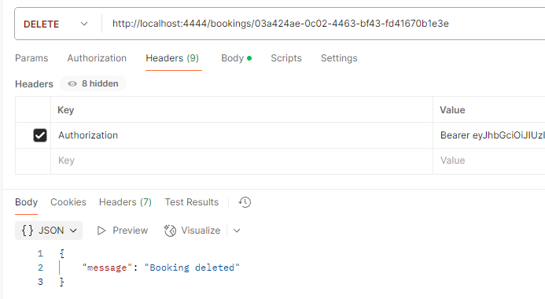

## Real-time Notifications (Socket.IO)
The platform uses Socket.IO to broadcast real-time notifications to all connected clients whenever a booking is created, updated, or deleted.  
**Requirements**  
- A browser or client that supports Socket.IO (v4)
- Connect to ws://localhost:4444 using the Socket.IO protocol   

Connection Example:
```
const socket = io("http://localhost:4444");

socket.on("connect", () => {
  console.log("Connected with ID:", socket.id);
});
```
**Backend Logic**  
The events are emitted from bookingController.ts after each respective operation:  
```
io.emit("bookingCreated", booking);
io.emit("bookingUpdated", updated);
io.emit("bookingDeleted", { id });
```
**Testing notification**  
To be able to test the notifications I build a simple http client.  
Created a booking in Postman:  
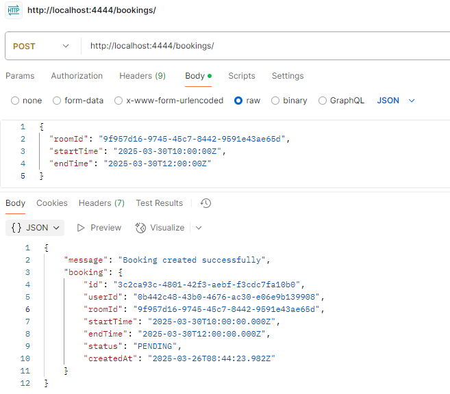

I updated the booking:  
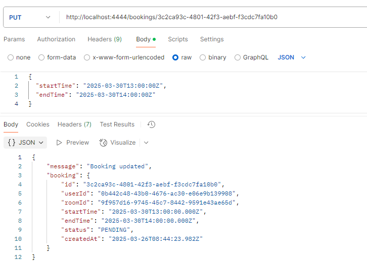

And last I deleted the booking:  
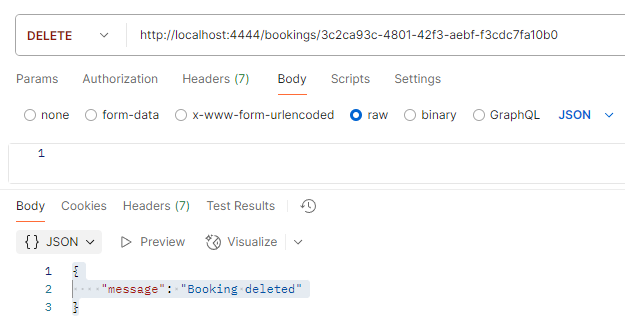!

And the results are shown in the the http client:  
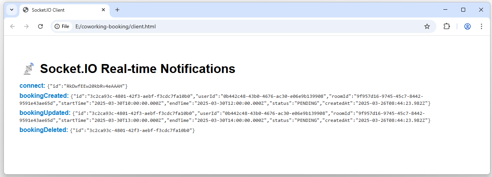

## Performance Optimization with Redis
To optimize performance and reduce database load, the application uses Redis to cache frequently accessed data.
To be more precise used **ioredis** because I found that ioredis is a robust, full-featured Redis client that is used in the world's biggest online commerce company Alibaba and many other awesome companies.
```
npm install ioredis
``` 

**Cached Endpoint:**  
GET /rooms – This endpoint first checks if room data exists in Redis cache before querying the database.

- If cached data is found, it's returned directly:  
→ "Rooms fetched from cache"

- If no cached data exists, room data is fetched from the database and stored in Redis for 60 seconds:  
→ "Rooms fetched from DB"

**Cache Invalidation**  
To ensure data consistency, the cache is automatically invalidated (deleted) when any of the following operations are performed:

- POST /rooms – Creating a new room
- PUT /rooms/:id – Updating a room
- DELETE /rooms/:id – Deleting a room

After invalidation, the next GET /rooms request will fetch fresh data from the database and re-cache it.

**Testing It**  
Verifying the caching behavior using Postman:  
Make a GET /rooms request → expect "Rooms fetched from DB"  
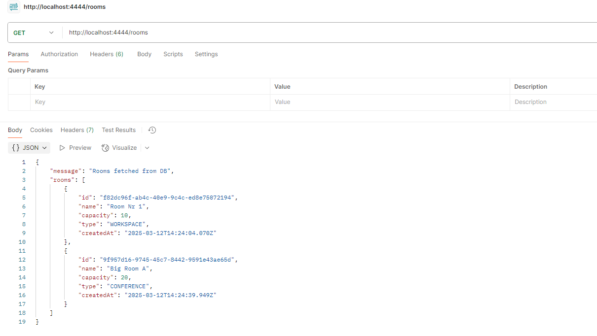

New GET withing 60 seconds gives rooms fetched from cache:  
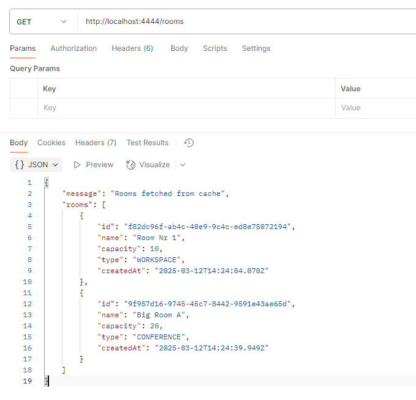

## Delete users
Allows an administrator to permanently delete a user account from the system.  

**Authorization**  
- Requires a valid JWT token in the Authorization header.
- Only users with the role ADMIN are allowed to access this route.

**Tests**  
Used Postman to try to delete a user as another user:  
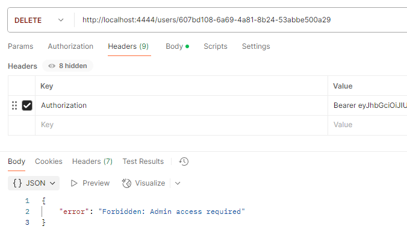

Used Postman to try to delete a user as an Admin:  
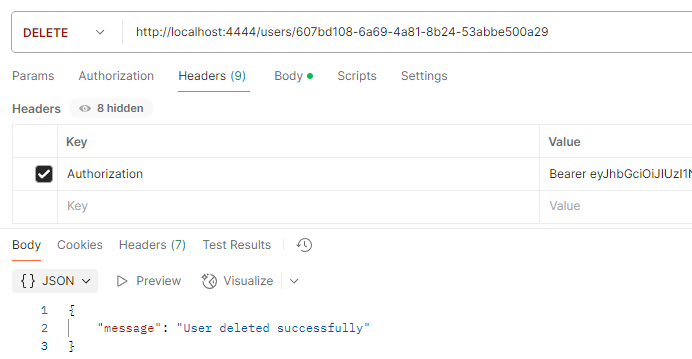

Also tested in Postman to delete a none existing user to test the error handling.

## Logging
**Overview**  
This project uses Winston as the logging library to keep track of important events, errors, and system behavior in a structured and persistent way.

**Features**  
- Logs both to the console and to files.
- Includes timestamps and log levels.
- Separates general logs and error logs.

**Log Files**
- logs/combined.log: All logs (info, warn, error, etc.)
- logs/error.log: Only error level logs 
- The logs/ directory is automatically created if it doesn't exist.

**Logged Events**
The system logs events such as:
- Successful logins
- Failed login attempts (wrong email or password)
- Attempt to access unauthorized routes
- Errors in controllers (e.g. booking conflicts, missing data)

**Testing logs**
I tested the login events.
- Login whith wrong email
- Login with wrong password
- Correct login

Looking in logs we can se all attempts has been logged:  
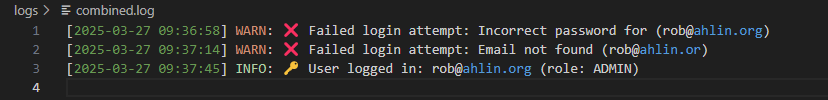

# Deploy to Heroku
Here's a brief summary of the steps I've completed to successfully deploy my backend application to Heroku.

**1. Adapting for Production**  
I adjusted my package.json scripts for Heroku:
```
"scripts": {
  "build": "tsc",
  "start": "node dist/index.js",
  "heroku-postbuild": "npm run build"
}
```
- ```heroku-postbuild``` ensures TypeScript compilation occurs automatically upon deployment.

Also, I made sure my server dynamically uses Heroku’s assigned port:
```
const port = process.env.PORT
```
**2. PostgreSQL Database (Supabase)**
I use Supabase as my PostgreSQL provider. These were the steps I took:
- Created a Supabase project at supabase.com.
- Copied the PostgreSQL connection string from Supabase's dashboard.
- Configured a Heroku environment variable named DATABASE_URL with the provided Supabase connection string.

**3. Configuring Redis Cloud**
Since my application uses Redis caching, I did the following:  
- Added the Redis Cloud add-on via the Heroku dashboard (Add-ons section).
- Configured the environment variable REDISCLOUD_URL using the URL provided by Redis Cloud.  
- fterward, I ran Prisma migrations to set up my database schema

Created a Redis client (```src/redis.ts```) to connect easily:
```
import Redis from "ioredis";

const redisUrl = process.env.REDISCLOUD_URL;
```
**4. Real-time Communication (Socket.IO)**
- I integrated Socket.IO to enable real-time functionality.  
- I verified this functionality using a simple [HTML client](https://coworking-booking-robert-d2b5d9a57f6a.herokuapp.com/client.html) hosted within the `/public` folder.

**5. Deployment to Heroku using Git**
I deployed the application to Heroku with these commands:
```
git add .
git commit -m "Commit message"
heroku login
heroku git:remote -a coworking-booking-robert
git push heroku main
```

**6. Verification and Testing**
After deployment, I checked the Heroku logs to confirm the application was running correctly:
```
heroku logs --tail
```
Logs confirmed:
- The server started successfully.
- Connection to Redis Cloud was established.
- Real-time communication via Socket.IO was functional.  

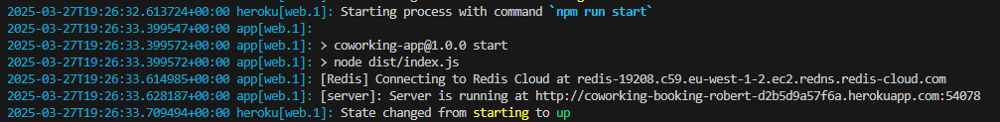

Testing of endpoints in Postman:  
Log in Admin user:  
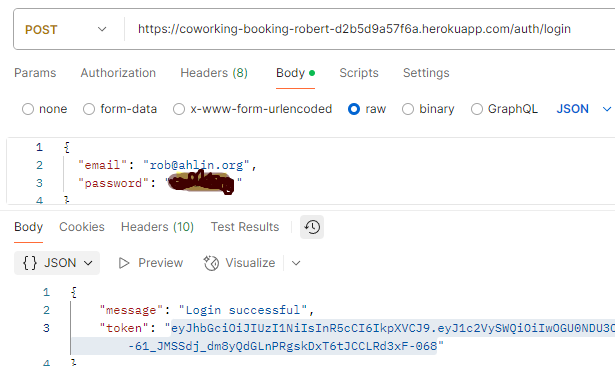  
Create a bookable room:  
  
Create a booking:  
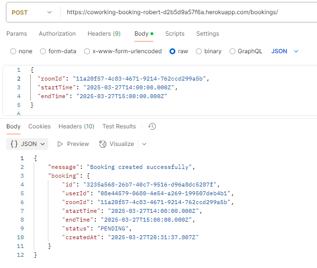  
 By making these tests I know that the endpoints are working.  

## API Endpoint Summary
| Method | Endpoint          | Description              | Auth Required |
|--------|-------------------|--------------------------|---------------|
| POST   | `/auth/register`  | User registration        | No            |
| POST   | `/auth/login`     | User login               | No            |
| GET    | `/rooms`          | Get all rooms            | Yes           |
| POST   | `/rooms`          | Create room (Admin only) | Yes (Admin)   |
| PUT    | `/rooms/:id`      | Update room (Admin only) | Yes (Admin)   |
| DELETE | `/rooms/:id`      | Delete room (Admin only) | Yes (Admin)   |
| POST   | `/bookings`       | Create booking           | Yes           |
| GET    | `/bookings`       | Get bookings             | Yes           |
| PUT    | `/bookings/:id`   | Update booking           | Yes           |
| DELETE | `/bookings/:id`   | Delete booking           | Yes           |
| DELETE | `/users/:id`      | Delete user (Admin only) | Yes (Admin)   |

## Security Considerations
- Passwords are hashed using bcrypt.
- JWT tokens are used for authentication.
- Protected endpoints use middleware for authentication and authorization.
- Input validation and sanitization is performed on all endpoints.

## Error Handling
- API returns appropriate HTTP status codes:
  - 400: Bad request (validation errors)
  - 401: Unauthorized (missing or invalid JWT token)
  - 403: Forbidden (insufficient permissions)
  - 404: Not Found (invalid IDs or non-existent resources)
  - 500: Internal Server Error (unexpected errors)

- Errors are logged using Winston in `logs/error.log`.

## Troubleshooting
- **Port Conflicts:** Ensure ports 5432 (PostgreSQL) and 6379 (Redis) are free before running Docker containers.
- **Prisma Migrations:** If migrations fail, run `npm run prisma:migrate` again or check the migration logs in your terminal.
- **Docker Issues:** Restart Docker Desktop if containers fail to start or behave unpredictably.
- **Redis Connection:** Confirm `REDISCLOUD_URL` in your environment.

# Future Improvements
- I'm thinkin of eventually create a Dashboard (front-end). Let's see about that.